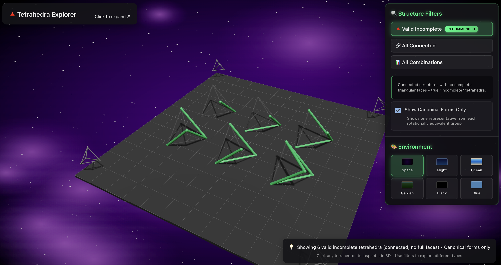
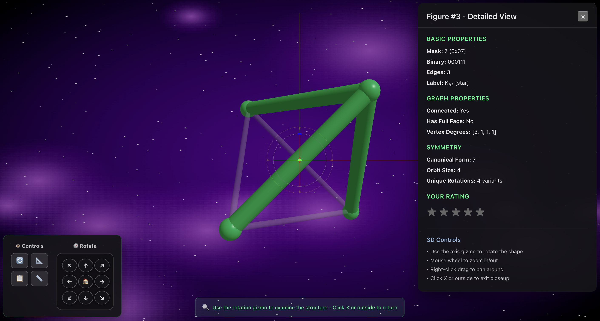

<h1 align="center" style="font-size: 3em;">
    🔮 Folyhedra.Fun 📐
</h1>

<p align="center">
    <strong>🌐 Live Demo: <a href="https://folyhedra.fun">folyhedra.fun</a></strong>
</p>

<p align="center">
    
</p>

<span align="center">


</span>

## Description

**Polyhedra Fun** is an interactive 3D visualization application that explores the fascinating world of incomplete Platonic solids. Built as part of a discrete mathematics research project, this application allows users to explore and interact with mathematically valid edge subsets of tetrahedra that maintain connectivity while avoiding complete triangular faces.

The application demonstrates advanced concepts in:
-  **Group Theory** and Burnside's Lemma
-  **3D Computational Geometry**
-  **React** with modern hooks and state management
-  **Three.js** for high-performance 3D graphics
-  **Combinatorial Mathematics** and enumeration

## Features

### 🎮 Interactive 3D Visualization
- **Real-time 3D rendering** of incomplete tetrahedra using WebGL
- **Orbit controls** for intuitive camera manipulation (zoom, pan, rotate)
- **Dynamic lighting** with customizable backgrounds (space, gradient, solid colors)
- **Smooth animations** for model transitions and closeup views

### 🔍 Advanced Filtering & Analysis
- **Connectivity filtering**: Show only connected edge subsets
- **Face validation**: Exclude models with complete triangular faces
- **Rotational uniqueness**: Toggle between all models or rotationally unique representatives
- **Edge style customization**: Solid lines, dashed lines, or glowing effects

### 🎨 Visual Customization
- **Multiple background themes**: Starfield, constellation, gradient, or solid colors
- **Edge styling options**: Customize appearance of wireframe models
- **Responsive design**: Optimized for desktop and mobile devices
- **Retro-inspired UI**: Nostalgic terminal-style interface elements

### 📊 Mathematical Insights
- **Real-time counting**: Display of valid model counts based on current filters
- **Group theory visualization**: Demonstrates A₄ rotation group properties
- **Educational tooltips**: Learn about the mathematical concepts behind each model

## Screenshots

<p align="center">
    
    
</p>

## Installation

### Prerequisites
- Node.js (v16 or higher)
- npm or yarn package manager
- Modern web browser with WebGL support

### Local Development Setup

1. **Clone the repository:**
   ```bash
   git clone https://github.com/yourusername/polyhedra-fun.git
   ```

2. **Navigate to the project directory:**
   ```bash
   cd polyhedra-fun
   ```

3. **Install dependencies:**
   ```bash
   npm install
   ```

4. **Start the development server:**
   ```bash
   npm run dev
   ```

5. **Open your browser:**
   - Navigate to `http://localhost:5173`
   - The application will automatically reload when you make changes

### Production Build

1. **Create a production build:**
   ```bash
   npm run build
   ```

2. **Preview the production build:**
   ```bash
   npm run preview
   ```

3. **Deploy to GitHub Pages:**
   ```bash
   npm run deploy
   ```

## Usage

### Basic Navigation
- **Mouse Controls**: 
  - Left click + drag to rotate the camera
  - Right click + drag to pan
  - Scroll wheel to zoom in/out
- **Touch Controls** (Mobile):
  - Single finger drag to rotate
  - Two finger pinch to zoom
  - Two finger drag to pan

### Filtering Options
- **Connected Only**: Shows only edge subsets that form connected graphs
- **No Full Faces**: Excludes models with complete triangular faces
- **Rotation Unique**: Displays only one representative from each rotational equivalence class

### Closeup Mode
- Click on any tetrahedron to enter closeup mode
- Examine individual models in detail
- Use inspection toolbar for advanced analysis
- Exit by clicking the back button or pressing ESC

## Mathematical Background

This application is based on research in **combinatorial geometry** and **group theory**:

### Theoretical Foundation
- **Platonic Solids**: The five regular polyhedra known since ancient times
- **Burnside's Lemma**: Used for counting objects under group actions
- **Graph Connectivity**: Ensuring edge subsets form connected structures
- **Rotational Symmetry**: A₄ alternating group with 12 rotational symmetries

### Research Applications
- **Discrete Mathematics Education**: Visual learning of abstract concepts
- **Computational Geometry**: Algorithms for 3D structure analysis
- **Materials Science**: Potential applications in crystal structure studies
- **Computer Graphics**: Procedural geometry generation techniques

## Technical Architecture

### Frontend Stack
- **React 19**: Modern functional components with hooks
- **Three.js**: 3D graphics and WebGL rendering
- **@react-three/fiber**: React renderer for Three.js
- **@react-three/drei**: Useful helpers and abstractions
- **Vite**: Fast build tool and development server

### Key Components
```
src/
├── components/
│   ├── TetrahedraScene.jsx      # Main 3D scene container
│   ├── TetrahedronGroup.jsx     # Individual tetrahedron rendering
│   ├── ControlPanel.jsx         # UI controls and filters
│   ├── CloseupView.jsx          # Detailed model inspection
│   └── BackgroundSelector.jsx   # Theme customization
├── utils/
│   └── tetrahedronMath.js       # Mathematical computations
└── App.jsx                      # Main application component
```

### Performance Optimizations
- **Instanced rendering** for multiple similar objects
- **Frustum culling** to avoid rendering off-screen objects
- **Level-of-detail (LOD)** for distant objects
- **Efficient state management** to minimize re-renders

## Development

### Available Scripts
- `npm run dev` - Start development server
- `npm run build` - Create production build
- `npm run preview` - Preview production build locally
- `npm run lint` - Run ESLint code analysis
- `npm run lint:fix` - Fix auto-fixable linting issues
- `npm run clean` - Clean build artifacts
- `npm run deploy` - Deploy to GitHub Pages

### Code Style
- **ESLint** configuration for consistent code formatting
- **Modern JavaScript** (ES6+) with React hooks
- **Functional programming** patterns where appropriate
- **Component composition** over inheritance

## Future Enhancements

### Planned Features
- **Extended Platonic Solids**: Cube, octahedron, icosahedron, dodecahedron
- **GPU Acceleration**: CUDA-powered computation for complex solids
- **Database Integration**: Store and retrieve pre-computed models
- **Educational Mode**: Guided tutorials and explanations
- **VR/AR Support**: Immersive 3D exploration
- **Export Functionality**: 3D model downloads (STL, OBJ formats)

## Contributing

We welcome contributions from mathematicians, developers, and educators! Here's how you can help:

1. **Fork the repository**
2. **Create a feature branch**: `git checkout -b feature/amazing-feature`
3. **Make your changes** and add tests if applicable
4. **Commit your changes**: `git commit -m 'Add amazing feature'`
5. **Push to the branch**: `git push origin feature/amazing-feature`
6. **Open a Pull Request**

### Areas for Contribution
- **Mathematical accuracy**: Verify computational results
- **Performance optimization**: Improve rendering efficiency
- **Educational content**: Add explanatory materials
- **Accessibility**: Improve usability for all users
- **Mobile experience**: Enhance touch interactions

## License

This project is licensed under the MIT License - see the [LICENSE](LICENSE) file for details.

## Contact & Connect

<div>
   <div>
      <a href="https://www.linkedin.com/in/nathanperfetti/">
         
         <br />
         <strong>Nathan Perfetti, <br /> Full Stack Developer & Mathematics Enthusiast</strong>  
      </a>
  </div>
<br />
  <div>
    <ul>
      <li>🌐 Portfolio: <a href="https://nathanperfetti.dev">https://nathanperfetti.dev</a></li>
      <li>💻 GitHub: <a href="https://github.com/perfettiful">@perfettiful</a></li>
      <li>💼 LinkedIn: <a href="https://www.linkedin.com/in/nathanperfetti/">@nathanperfetti</a></li>
      <li>📺 YouTube: <a href="https://www.youtube.com/@nathan_codes/videos">@nathan_codes</a></li>
      <li>🔬 Research: Computational Geometry & Interactive Mathematics</li>
    </ul>
  </div>
</div>

---

<p align="center">
    <strong>🔮 Exploring the beauty of mathematics through interactive 3D visualization 🔮</strong>
</p>

<p align="center">
    <em>"In mathematics, the art of proposing a question must be held of higher value than solving it." - Georg Cantor</em>
</p>
